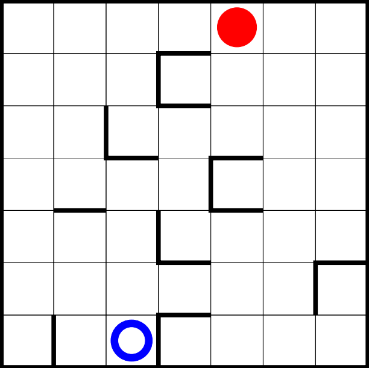

># **A puzzle with two colorful balls**
> - The player can move with the red ball (shown on the picture) to any adjacent squares that aren't blocked by a wall.  
> - Movement with the red ball results in movement with the blue ball in the opposite direction, therefore movement is only possible if none of the balls are blocked by a wall.  
>
> **The goal is to make the balls touch.**

>## **A possible solution:**
